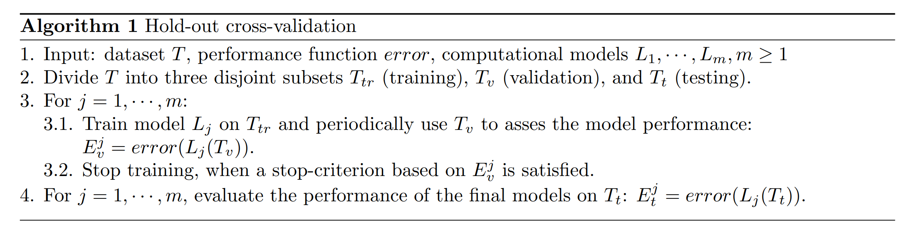
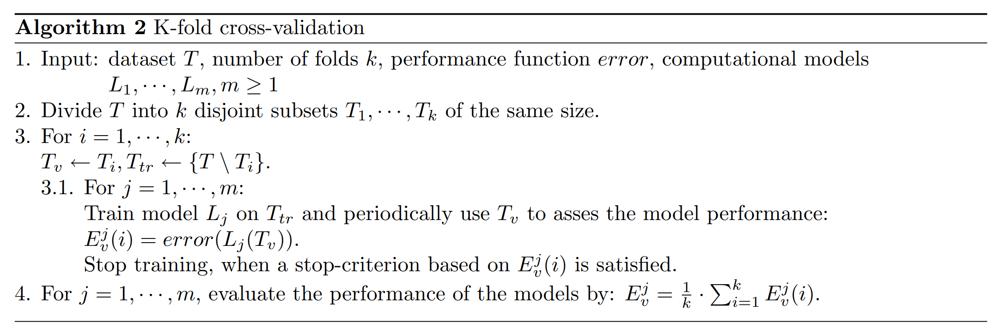

# Guideline to data splitting in machine learning

Suppose we want to train a supervised learning model on the dataset T = {}. 
At the end of the training process, the final model should predict correct outputs for the input samples from T, but it should also be able to generalize well to previously unseen data.

Generalization refers to your model's ability to adapt properly to new, previously unseen data, *drawn from the same distribution* as the one used to create the model [9].  Poor generalization can be characterized by over-training. If the model over-trains, it just memorizes the training examples and it is not able to give correct outputs also for patterns that were not in the training dataset.

Cross-validation techniques belong to conventional approaches used to ensure good generalization and to avoid over-training. The basic idea is to divide the dataset T into two subsets – one subset is used for training while the other subset is left out and the performance of the final model is evaluated on it. 
- The main purpose of cross-validation is to achieve a stable and confident estimate of the model performance. 
- Cross-validation techniques can also be used when evaluating and mutually comparing more models, various training algorithms, or when seeking for optimal model parameters

Commonly used types of cross-validation: hold-out cross validation and k-fold cross-validation

### Hold-out cross-validation
In hold-out cross-validation, we separates the dataset T (of size n) into three mutually disjoint subsets – training Ttr, validation Tv, and testing Tt of sizes ntr, nv and nt successively. 
- The model is trained on the training subset Ttr, 
- The validation subset Tv is periodically used to evaluate the model performance during the training to avoid over-training. The training is stopped, when the performance on Tv is good enough or when it stops improving.
- The testing subset Tt is used to gain a confident estimate of the models’ performance.

The holdout method has two basic drawbacks
- In problems where we have a sparse dataset we may not be able to afford the “luxury” of setting aside a portion of the dataset for testing
- Since it is a single train-and-test experiment, the holdout estimate of error rate will be misleading if we happen to get an “unfortunate” split. The chosen split heavily affects the quality of the final model. The estimate of the model performance (evaluated on the testing set) should be stable – it should have a low bias and variance. If the dataset is split poorly, the data subsets will not sufficiently cover the data and especially the variance will increase.

### K-fold cross-validation
The k-fold cross-validation is useful if not enough data for the hold-out cross-validation is available. The dataset T is divided into k parts of the same size. One part forms the validation (testing) set Tv, the other parts form the training set Ttr. This process is repeated for each part of the data.

## Reference

1. https://www.mff.cuni.cz/veda/konference/wds/proc/pdf10/WDS10_105_i1_Reitermanova.pdf
2. https://developers.google.com/machine-learning/crash-course/training-and-test-sets/splitting-data
3. https://neuro.cs.ut.ee/wp-content/uploads/2015/05/BNNI2015-MLPipeline-exercise.pdf
4. https://www.mimuw.edu.pl/~son/datamining/DM/eval-train-test-xval.pdf
5. http://research.cs.tamu.edu/prism/lectures/iss/iss_l13.pdf
6. http://www.coli.uni-saarland.de/~crocker/Teaching/Connectionist/lecture11_4up.pdf
7. https://stats.stackexchange.com/questions/52274/how-to-choose-a-predictive-model-after-k-fold-cross-validation
8. https://datascience.stackexchange.com/questions/13960/how-to-choose-a-classifier-after-cross-validation/13964
9. [Machine learning crash course](https://developers.google.com/machine-learning/crash-course/generalization/video-lecture#targetText=Generalization,used%20to%20create%20the%20model.&targetText=Divide%20a%20data%20set%20into%20a%20training%20set%20and%20a%20test%20set)
[10] https://www.quora.com/What-is-generalization-in-machine-learning
[11] http://research.cs.tamu.edu/prism/lectures/pr/pr_l13.pdf
